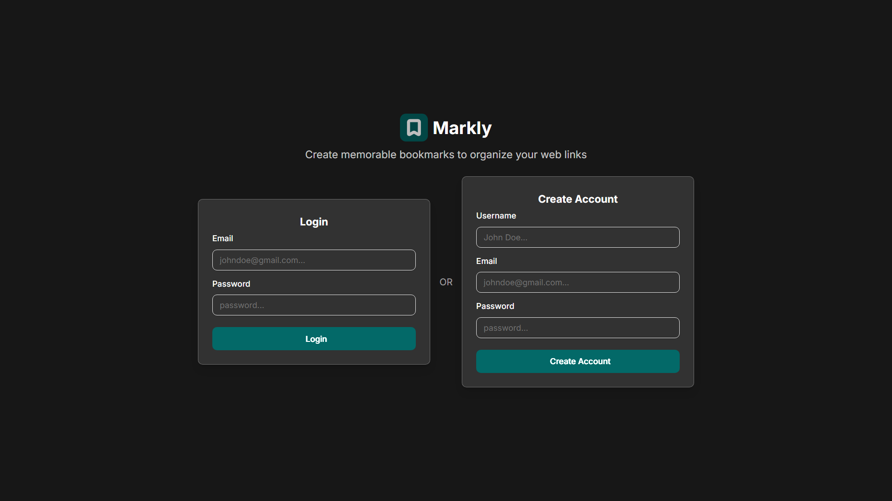
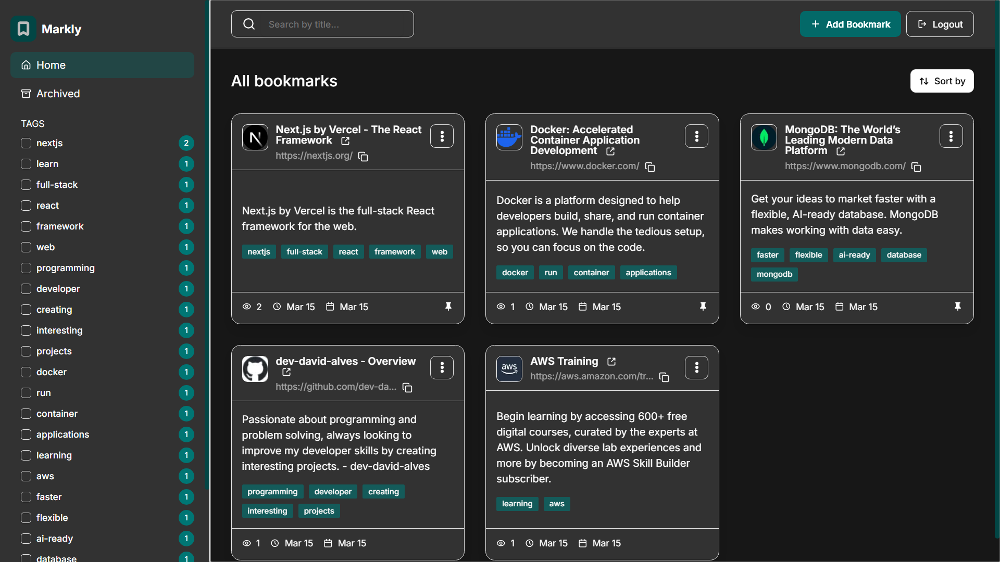
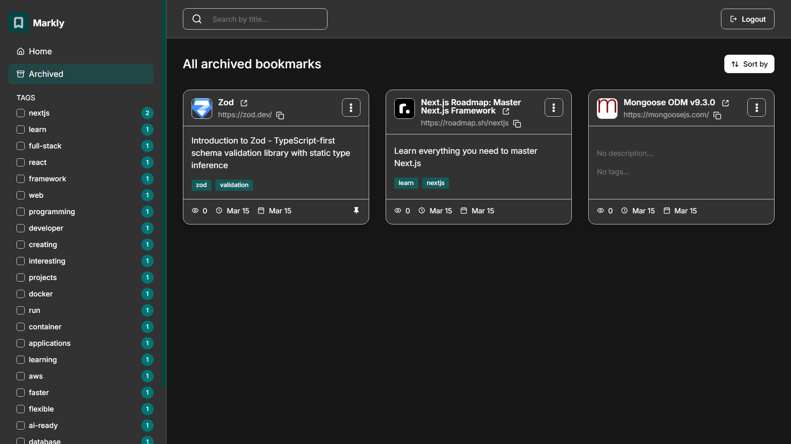
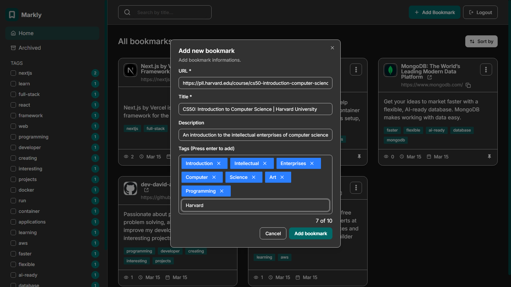
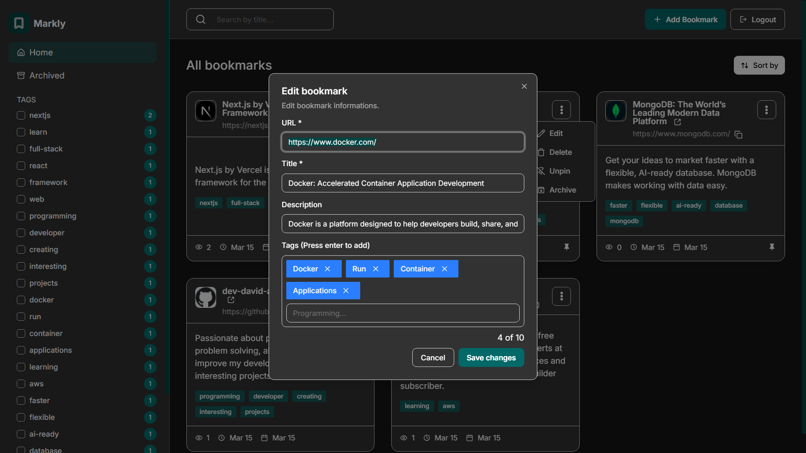
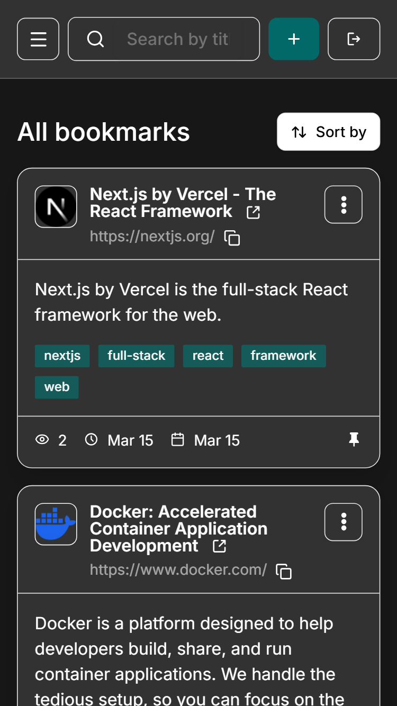
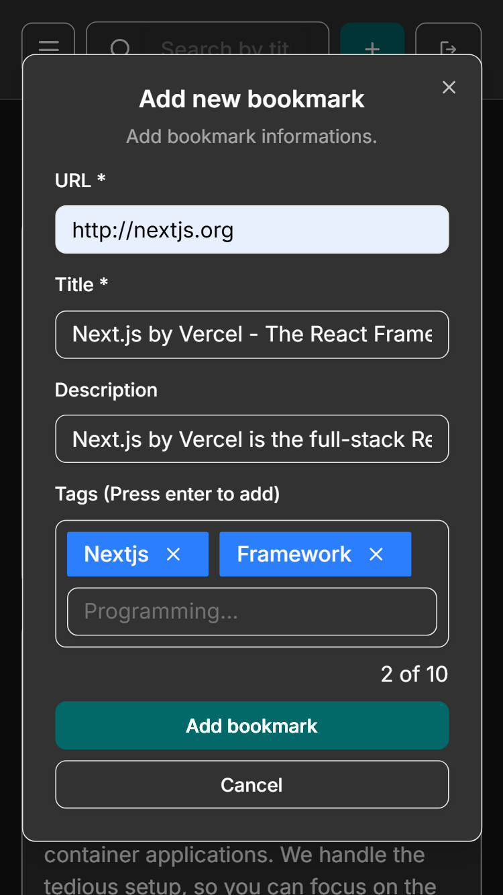
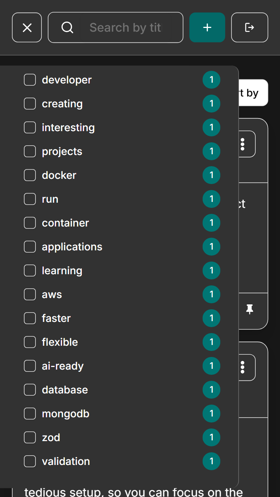

# 📝 Markly - Bookmark Manager

A comprehensive web app for managing your bookmarks built to explore **Next.js**, **React**, modern UI components, and full-stack development. Add, organize, search, and discover your web bookmarks effortlessly.

Organize your web resources with custom tags, archive old bookmarks, pin important links, and search by title. Built with a clean, responsive layout featuring advanced filtering, a search bar, and secure authentication.

---


---

## 🚀 Features

- Add new bookmarks with a title, description, website URL, and tags
- View all your bookmarks in a centralized dashboard
- See bookmark details, including favicon, title, URL, description, tags, view count, last visited date, and date added
- Search for bookmarks by title in the search bar
- Filter bookmarks by selecting one or multiple tags from the sidebar
- Reset tag filters to view all bookmarks again
- Archive bookmarks to remove them from the main view without deleting them
- View archived bookmarks
- Pin/unpin bookmarks to keep important ones easily accessible
- Edit existing bookmarks to update their details
- Copy bookmark URLs to the clipboard
- Visit bookmarked websites directly from the app
- Sort bookmarks by "Recently added", "Recently visited", or "Most visited"
- See hover and focus states for all interactive elements on the page
- View the optimal layout for the interface depending on their device's screen size

---

## 🧩 Tech Stack

**Frontend & Backend:** Next.js + React + TypeScript  
**UI Components:** Radix UI/ShadCN (Base UI)  
**Authentication:** Better Auth  
**Database:** MongoDB + Mongoose  
**Styling:** Tailwind CSS  
**Icons:** Iconify React  
**Web Scraping:** Cheerio (for bookmark metadata)  
**Containerization:** Docker & Docker Compose

---

## 🛠️ Getting Started

### Prerequisites

- Node.js (v20 or higher)
- npm
- MongoDB instance
- Docker (optional for containerized setup)

### Installation

1. **Clone this repository:**

    ```bash
    git clone https://github.com/dev-david-alves/markly-bookmark-manager.git
    cd markly-bookmark-manager
    ```

2. **Install dependencies:**

    ```bash
    npm install
    ```

3. **Environment Setup:**  
   Create a `.env.local` file and add necessary variables (e.g., MongoDB URI, auth secrets).

4. **Start the development server:**

    ```bash
    npm run dev
    ```

5. **Open the local address:**
    ```
    http://localhost:3000
    ```

---

## 🐳 Running with Docker

1. **Build and start the application:**

    ```bash
    docker-compose up -d
    ```

2. **Access the application** at `http://localhost:3000`.

---

## 🖼️ Screenshots

### 💻 Desktop - Auth Page



### 💻 Desktop - Home Page



### 💻 Desktop - Archived Page



### 💻 Desktop - Add Bookmark



### 💻 Desktop - Edit Bookmark



### 📱 Mobile - Home Page



### 📱 Mobile - Add Bookmark



### 📱 Mobile - Sidebar Opened



---

## 👤 Author

**David Alves**  
Bachelor in Computer Science at the Federal University of Ceará  
💼 [LinkedIn](https://www.linkedin.com/in/dev-david-alves/)  
📧 [david.als.soares@gmail.com](mailto:david.als.soares@gmail.com)

📂 **Project Link:** [https://github.com/dev-david-alves/markly-bookmark-manager](https://github.com/dev-david-alves/markly-bookmark-manager)

---

## 🪪 License

This project is licensed under the [MIT License](LICENSE).

---

⭐ If you found this project useful or inspiring, consider giving it a star!
